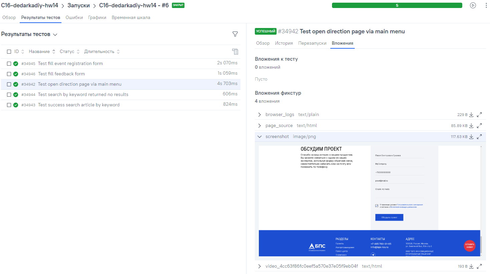

<h1 align="center">Проект автоматизации <a href="https://bps-iss.ru">сайта</a> компании БПС</h1>

### Описание:
Было разработано несколько тест-кейсов:
- [x] Проверка перехода через меню к выбранному направлению
- [x] Проверка успешного поиска статей по ключевому слову  
- [x] Проверка поиска статей, поиск результатов не дал
- [x] Проверка заполнения формы регистрации на мероприятие
- [x] Проверка заполнения формы обратной связи

Кейсы реализованы основе шаблона PageObject

## Используемый стек технологий и инструментов

|                        Python                         |                        Pytest                         |                          Selen                          |                        Selenoid                         |                        Git                         |                        Jenkins                         |                        Allure                         |                        Allure TestOps                         |
|:-----------------------------------------------------:|:-----------------------------------------------------:|:-------------------------------------------------------:|:-------------------------------------------------------:|:--------------------------------------------------:|:------------------------------------------------------:|:-----------------------------------------------------:|:-------------------------------------------------------------:|
|  |  |  |  |  |  |  |  |

## Запуск автотестов
### На Jenkins реализован параметризованный запуск тестов:
```bash
python -m venv .venv
source .venv/bin/activate
pip install -r requirements.txt
pytest . --browser_url=${BROWSER_URL} --browser_version=${BROWSER_VERSION}
```


### Тесты выполняются на удаленном браузере благодаря использованию Selenoid
Логин и пароль для доступа к Selenoid хранятся в переменных среды
### Добавлена генерация отчетов на allure а так же интеграция с Allure TestOpt


### Allure TestOpt 
#### Suites: Помимо автотестов в добавлены ручные тест-кейс


#### Дашборд:


### При выполнении автотестов, для тестов линкуются логи, скриншоты, html-страница и видео прохождения кейса


##### Пример видео:


### Добавлено уведомление о выполнении прохождении тест-кейсов через чат-бота в Telegrm
